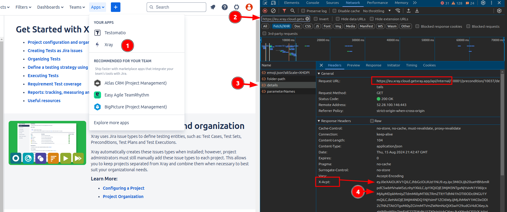

# XRay ➡ Testomat.io Migration Script

This script migrates test cases from XRay to [Testomat.io](https://testomat.io) via API.

You are free to customize this script if the default behavior doesn't fit your needs.

## Set Up Locally

* Ensure **NodeJS 20+** is installed
* Clone this repository
* Copy `.env.example` to `.env`

```
cp .env.example .env
```

* Obtain XRay token from XRay app

> ! Due to unavaibility of XRay API, you need to obtain token manually.

Open XRay app, open DevTools (F12), go to Network tab, and find XRay requests by filtering by URL

```
https://eu.xray.cloud.getxray.app
```

Find any request to XRay API, and in `Headers` tab find `X-Acpt` header. This is your token.



Copy it to `.env` file


copy `Authorization` header from any request to XRay API.

* Fill in XRay and Testomat.io credentials into `.env` file
* Install dependencies

```
npm i
```

* Run script

```
npm start
```

## Troubleshooting

#### Authentication request has expired. Try reloading the page

If you see error like this:

```
Error fetching data: Error: Failed to fetch data: /test-repository: 401 Unauthorized
{"error":"Authentication request has expired. Try reloading the page."}
```

Try to open XRay app and fetch a new token and run script again.


## Debugging

To enable more verbose output you can add debug flags via `DEBUG=` environment variable:

* `DEBUG="testomatio:xray:in"` - print all data coming from XRay
* `DEBUG="testomatio:xray:out"` - print all data posting to Testomat.io
* `DEBUG="testomatio:xray:migrate"` - print all data processing
* `DEBUG="testomatio:xray:*"` - print all debug information

```
DEBUG="testomatio:testrail:*" npm start
```

## Customization

We keep this repository public, so you could customize the data you import.

Update `migrate.js` script to customize how sections, suites, and cases are obtained. You can customize the way how steps are transformed or test descriptions.

Update the following file and run the script.

## License

MIT
